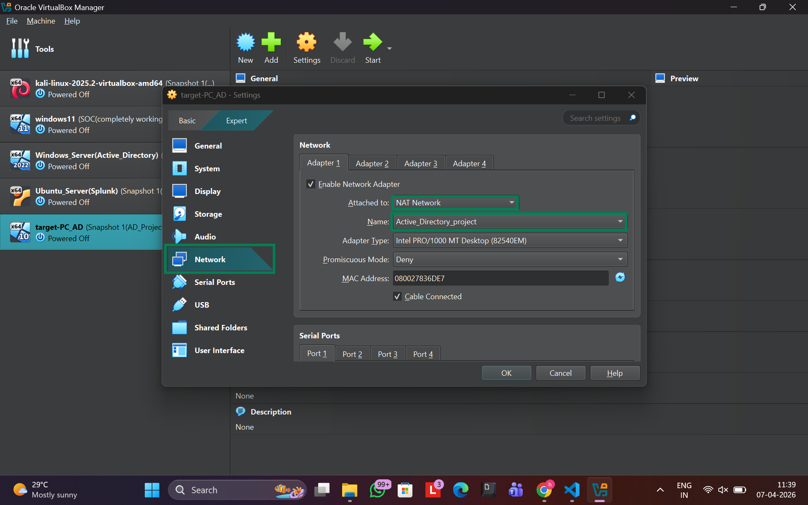

# 🛠️ Active Directory SOC Lab – Complete Setup Guide

## 🎯 Objective
This lab simulates a real-world Active Directory (AD) environment to perform attack simulations and detect malicious activity using Splunk SIEM and Sysmon telemetry.

---

## 🏗️ Lab Environment

| System | Role | IP Address |
|--------|------|-----------|
| Kali Linux | Attacker | 192.168.56.250 |
| Windows 10 | Victim | 192.168.56.100 |
| Windows Server 2019 | Domain Controller | 192.168.56.7 |
| Ubuntu Server | Splunk SIEM | 192.168.56.10 |

Domain: hettilava.local

---

## 🌐 Network Configuration
- Use NAT Network
- Assign static IPs as shown above
- Set DNS to 192.168.56.7

Verify:
ping 192.168.56.7
ping 192.168.56.10

## 📸 Setup Screenshots

  
  
  

---

## 🏢 Active Directory Setup

Install AD:
Install-WindowsServer(2022): https://www.microsoft.com/en-us/evalcenter/download-windows-server-2022

Promote:
Install-ADDSForest -DomainName "hettilava.local"

Create users:
net user user1 Pass@123 /add /domain
net user user2 Pass@123 /add /domain

Screenshot: screenshots/setup/ad-users.png

---

## 💻 Domain Join

- Join Windows 10 to domain: hettilava.local

Verify:
whoami

Expected:
hettilava\user1

Screenshot: screenshots/setup/domain-join.png

---

## 📊 Sysmon Setup

Install:
sysmon64.exe -i sysmonconfig.xml

Verify:
Get-WinEvent -LogName "Microsoft-Windows-Sysmon/Operational"

Screenshot: screenshots/setup/sysmon-logs.png

---

## 📡 Splunk Setup

Install:
wget -O splunk.deb <download_link>
sudo dpkg -i splunk.deb
sudo /opt/splunk/bin/splunk start --accept-license

Enable port 9997

Access:
http://192.168.56.10:8000

Screenshot: screenshots/setup/splunk-dashboard.png

---

## 🔁 Forwarder Setup

splunk add forward-server 192.168.56.10:9997
splunk add monitor C:\Windows\System32\winevt\Logs\

---

## 📥 Log Verification

index=wineventlog

Screenshot: screenshots/setup/splunk-logs.png

---

## ⚠️ Troubleshooting

Sysmon:
Get-Service sysmon

Ubuntu IP:
sudo nano /etc/netplan/*.yaml
sudo netplan apply

---

## 🔐 Note
Lab is isolated. Use only for educational purposes.
