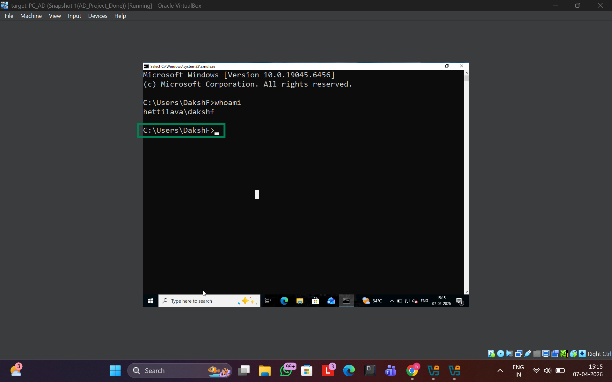

# 🛠️ Active Directory SOC Lab – Complete Setup Guide

## 🎯 Objective
This lab simulates a real-world Active Directory (AD) environment to perform attack simulations and detect malicious activity using Splunk SIEM and Sysmon telemetry.

---

## 🏗️ Lab Environment

| System | Role | IP Address |
|--------|------|-----------|
| Kali Linux | Attacker | 192.168.56.250 |
| Windows 10 | Victim | 192.168.56.100 |
| Windows Server 2019 | Domain Controller | 192.168.56.7 |
| Ubuntu Server | Splunk SIEM | 192.168.56.10 |

Domain: hettilava.local

---

## 🌐 Network Configuration
- Use NAT Network
- Assign static IPs as shown above
- Set DNS to 192.168.56.7

Verify:
ping 192.168.56.7
ping 192.168.56.10

## 📸 Setup Screenshots

  

---

## 🏢 Active Directory Setup

## 🎯 Objective

This document outlines the step-by-step setup of an Active Directory (AD) environment using GUI-based configuration.  
The setup enables domain-based authentication, user management, and log generation for security monitoring.

---

## 🖥️ Step 1: Configure Static IP (Windows Server)

Navigate to:

Control Panel → Network and Sharing Center → Change Adapter Settings

- Right-click **Ethernet → Properties**
- Select **Internet Protocol Version 4 (IPv4) → Properties**

Set the following:

- IP Address: `192.168.56.7`  
- Subnet Mask: `255.255.255.0`  
- Default Gateway: `192.168.56.1`  
- Preferred DNS: `192.168.56.7`  

📸 **Screenshot**

  

---

## 🏗️ Step 2: Install Active Directory Domain Services

1. Open **Server Manager**
2. Click **Manage → Add Roles and Features**
3. Select:
   - Role-based or feature-based installation
4. Select your server
5. Check:
   - ✅ Active Directory Domain Services
6. Click:
   - Add Features → Next → Install

---

## 🌐 Step 3: Promote to Domain Controller

1. In Server Manager:
   - Click notification flag
2. Select:
   - **Promote this server to a domain controller**

### Configuration:

- Select: **Add a new forest**
- Root domain name:

- Now the Active Directory Domain Services is ready to craete and manage the new and old users

---

## 💻 Domain Join

- Join Windows 10 to domain: hettilava.local

Verify:
whoami

Expected:
hettilava\user1
here user1 is DakshF

📸 **Screenshot**

  

---

# 📊 Sysmon & Splunk Setup (Telemetry + SIEM Integration)

---

## 🎯 Objective

This section configures endpoint telemetry using Sysmon and centralizes log collection using Splunk SIEM.

The goal is to:
- Capture detailed system activity (process, network, etc.)
- Forward logs to Splunk
- Enable detection of attack behaviors

---

# 🧩 PART 1: Sysmon Setup (Windows)

---

## 🖥️ Step 1: Download Sysmon

Download from Microsoft Sysinternals:
- https://learn.microsoft.com/en-us/sysinternals/downloads/sysmon

Also download a configuration file (recommended):
- SwiftOnSecurity Sysmon config (GitHub)

Place files in:

C:\Sysmon\

📸 Screenshot:
../screenshots/setup/sysmon-download.png

---

## ⚙️ Step 2: Install Sysmon

Open Command Prompt (Admin):

cd C:\Sysmon
sysmon64.exe -i sysmonconfig.xml

Accept license when prompted

---

## 📊 Step 3: Verify Sysmon Installation

Event Viewer → Applications and Services Logs → Microsoft → Windows → Sysmon → Operational

OR:

Get-WinEvent -LogName "Microsoft-Windows-Sysmon/Operational"

📸 Screenshot:
../screenshot/sysmon-logs.png

---

## 🧠 Key Events

- Event ID 1 → Process Creation  
- Event ID 3 → Network Connection  
- Event ID 10 → Process Access  

---

# 🧩 PART 2: Splunk Setup (Ubuntu Server)

---

## 🖥️ Step 4: Download Splunk

Download Splunk Enterprise (.deb)

On Ubuntu:

wget -O splunk.deb <download_link>

---

## ⚙️ Step 5: Install Splunk

sudo dpkg -i splunk.deb
sudo /opt/splunk/bin/splunk start --accept-license

---

## 🌐 Step 6: Access Splunk

http://192.168.56.10:8000

Login:
admin / password set during install

📸 Screenshot:
../screenshot/splunk-dashboard.png

---

## 🔁 Step 7: Enable Receiving Port

Settings → Forwarding and Receiving → Receive Data

Add port:
9997

📸 Screenshot:
../screenshot/splunk-port.png

---

# 🧩 PART 3: Universal Forwarder

---

## 💻 Step 8: Install Forwarder

Install on:
- Windows 10  
- Windows Server  

Set:
192.168.56.10:9997

---

## ⚙️ Step 9: Configure Forwarding

splunk add forward-server 192.168.56.10:9997
Add a file at path C:\Program Files\SplunkUniversalForwarder\etc\system\local
File Content:

---

# 📥 PART 4: Verification

---

## 🔍 Step 10: Check Logs

index=wineventlog

Expected:
- 4624  
- 4625  
- Sysmon logs  

📸 Screenshot:
../screenshots/setup/splunk-logs.png

---

# 🧪 Final Validation

- Sysmon working  
- Logs visible in Splunk  
- Network connected  

---

# ⚠️ Troubleshooting

Sysmon:
Get-Service sysmon

Splunk:
Check port 9997

---

## 🔐 Note

Lab is isolated and for educational use only.

## 📡 Splunk Setup

Install:
wget -O splunk.deb <download_link>
sudo dpkg -i splunk.deb
sudo /opt/splunk/bin/splunk start --accept-license

Enable port 9997

Access:
http://192.168.56.10:8000

Screenshot: screenshots/setup/splunk-dashboard.png

---

## 🔁 Forwarder Setup

splunk add forward-server 192.168.56.10:9997
splunk add monitor C:\Windows\System32\winevt\Logs\

---

## 📥 Log Verification

index=wineventlog

Screenshot: screenshots/setup/splunk-logs.png

---

## ⚠️ Troubleshooting

Sysmon:
Get-Service sysmon

Ubuntu IP:
sudo nano /etc/netplan/*.yaml
sudo netplan apply

---

## 🔐 Note
Lab is isolated. Use only for educational purposes.
